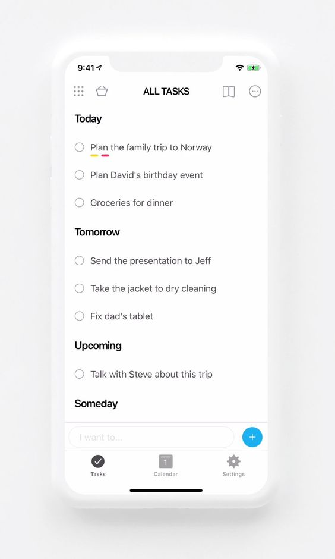

# Todo Application Design
> Compare platform and framework with Todo Applications
> Will show Expo(React Native Based) and Mobile Web Application

## Design

## GPT Prompt

1. as web designer, write mobile web html and tailwindcss with three rows using flex
   first one is for title, second one is contents, last one is footer
2. title row is always displayed when scroll at bottom and footer row is always displayed when scroll at top
3. add todo items lists which display rounded checkbox, title, multiline descripsions inside of content row
4. change checkbox is rounded
5. position checkbox at same level of task
6. title of task(task list) should be independant div block and fill different color
7. add divider between todo items and put more margin beneath title of task(task list)
8. add input field and submit button inside of footer
9. add bottom tab menu below input area in footer
10. align bottom menu in stretched

6. add todo list in the middle row support scroll
7. boxing each todo items with round corner
8. adjust todo item tag into div and split todo item into status check button and title
9. add multiline descriptions beneath of task title with smaller font
10. adjust description div left indent same as title
11. add 20 todo items as example
12. adjust middle row hieght  filling rest  space of screen
13. adjust scroll-container height filling of parent height
14. adjust bottom row is fixed position
15. the first row is fiex position at top of screen
16. adjust each rows using flex and first row applied flex start, the middle row is flex grow, the bottom row is flex end